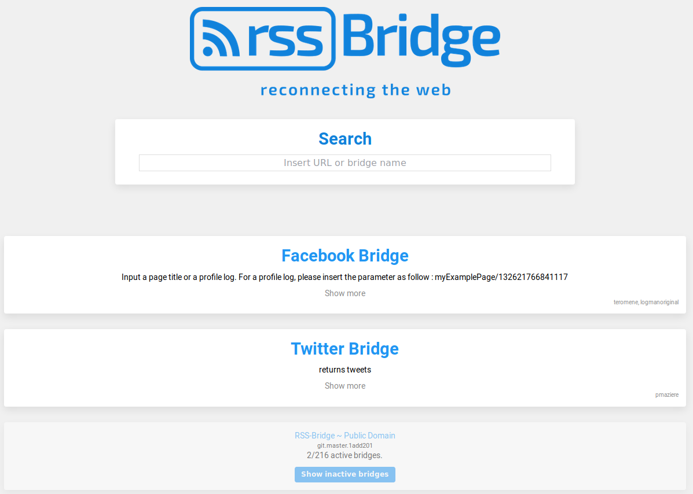

<!--
Важно: этот README был автоматически сгенерирован <https://github.com/YunoHost/apps/tree/master/tools/readme_generator>
Он НЕ ДОЛЖЕН редактироваться вручную.
-->

# RSS-Bridge для YunoHost

[](https://ci-apps.yunohost.org/ci/apps/rss-bridge/)


[](https://install-app.yunohost.org/?app=rss-bridge)

*[Прочтите этот README на других языках.](./ALL_README.md)*

> *Этот пакет позволяет Вам установить RSS-Bridge быстро и просто на YunoHost-сервер.*  
> *Если у Вас нет YunoHost, пожалуйста, посмотрите [инструкцию](https://yunohost.org/install), чтобы узнать, как установить его.*

## Обзор

RSS-Bridge is a project capable of generating RSS and Atom feeds for websites that don't have one. It can be used on webservers or as a stand-alone application in CLI mode.

Important: RSS-Bridge is not a feed reader or feed aggregator, but a tool to generate feeds that are consumed by feed readers and feed aggregators. Find a list of feed aggregators on Wikipedia.

### Supported sites/pages (main)

 * `FlickrExplore` : [Latest interesting images](http://www.flickr.com/explore) from Flickr
 * `GoogleSearch` : Most recent results from Google Search
 * `GooglePlus` : Most recent posts of user timeline
 * `Twitter` : Return keyword/hashtag search or user timeline
 * `Identi.ca` : Identica user timeline (Should be compatible with other Pump.io instances)
 * `YouTube` : YouTube user channel, playlist or search
 * `Cryptome` : Returns the most recent documents from [Cryptome.org](http://cryptome.org/)
 * `DansTonChat`: Most recent quotes from [danstonchat.com](http://danstonchat.com/)
 * `DuckDuckGo`: Most recent results from [DuckDuckGo.com](https://duckduckgo.com/)
 * `Instagram`: Most recent photos from an Instagram user
 * `OpenClassrooms`: Lastest tutorials from [fr.openclassrooms.com](http://fr.openclassrooms.com/)
 * `Pinterest`: Most recent photos from user or search
 * `ScmbBridge`: Newest stories from [secouchermoinsbete.fr](http://secouchermoinsbete.fr/)
 * `Wikipedia`: highlighted articles from [Wikipedia](https://wikipedia.org/) in English, German, French or Esperanto
 * `Bandcamp` : Returns last release from [bandcamp](https://bandcamp.com/) for a tag
 * `ThePirateBay` : Returns the newest indexed torrents from [The Pirate Bay](https://thepiratebay.se/) with keywords
 * `Facebook` : Returns the latest posts on a page or profile on [Facebook](https://facebook.com/)

Plus [many other bridges](bridges/) to enable, thanks to the community

### Output format

Output format can take several forms:

 * `Atom` : ATOM Feed, for use in RSS/Feed readers
 * `Mrss` : MRSS Feed, for use in RSS/Feed readers
 * `Json` : Json, for consumption by other applications.
 * `Html` : Simple html page.
 * `Plaintext` : raw text (php object, as returned by print_r)
 

**Поставляемая версия:** 2025.01.26~ynh1

**Демо-версия:** <https://wtf.roflcopter.fr/rss-bridge/>

## Снимки экрана



## Документация и ресурсы

- Официальная документация администратора: <https://github.com/RSS-Bridge/rss-bridge/wiki>
- Репозиторий кода главной ветки приложения: <https://github.com/RSS-Bridge/rss-bridge>
- Магазин YunoHost: <https://apps.yunohost.org/app/rss-bridge>
- Сообщите об ошибке: <https://github.com/YunoHost-Apps/rss-bridge_ynh/issues>

## Информация для разработчиков

Пришлите Ваш запрос на слияние в [ветку `testing`](https://github.com/YunoHost-Apps/rss-bridge_ynh/tree/testing).

Чтобы попробовать ветку `testing`, пожалуйста, сделайте что-то вроде этого:

```bash
sudo yunohost app install https://github.com/YunoHost-Apps/rss-bridge_ynh/tree/testing --debug
или
sudo yunohost app upgrade rss-bridge -u https://github.com/YunoHost-Apps/rss-bridge_ynh/tree/testing --debug
```

**Больше информации о пакетировании приложений:** <https://yunohost.org/packaging_apps>
